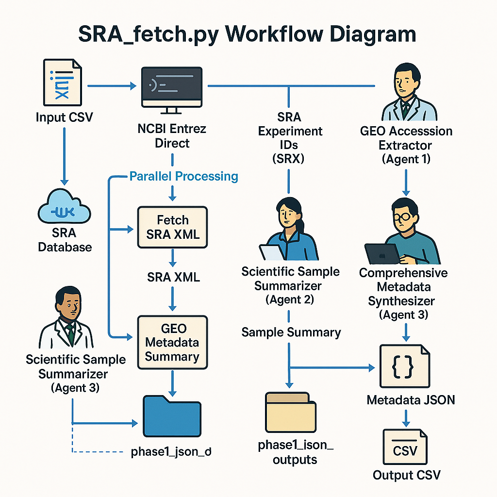

# SRA Fetch AI Agent 🧬🧠🔍

**Automated NGS Data Fetching and AI-Powered Metadata Processing**

## Overview

`SRA_fetch.py` is a Python command-line tool designed to automate the retrieval of Next-Generation Sequencing (NGS) data from NCBI's Sequence Read Archive (SRA) and Gene Expression Omnibus (GEO). It processes associated metadata using keyword-driven searches and leverages AI agents powered by Large Language Models (LLMs) via `langchain-ollama` to interpret, extract, and synthesize complex biological metadata.

### AI Agent Roles

The script employs three specialized AI agents for metadata processing:

1. **GEO Accession Extractor**
   - **Role**: Extracts GEO Series (GSE) and GEO Sample (GSM) accession numbers from SRA Experiment XML.
   - **Output**: JSON object, e.g., `{"gse": "GSE12345", "gsm": "GSM123456"}`.
   - **Fallback**: Uses regex if the LLM fails.

2. **Scientific Sample Summarizer**
   - **Role**: Generates a concise scientific summary (2–4 sentences) for each sample, acting as a biomedical data scientist.
   - **Input**: SRA Experiment XML, GEO data summary (if available), original search keyword, and SRA ID.
   - **Output**: Human-readable text summary.

3. **Comprehensive Metadata Synthesizer**
   - **Role**: Analyzes scientific summaries, SRA XML, and GEO data to extract and structure metadata fields as a meticulous biomedical data curator.
   - **Output**: Detailed JSON object with fields like species, sample type, sequencing technique, disease description, treatment protocols, and ChIP-Seq details, mapped to the final CSV output.



## Features

- **Keyword-Driven Data Discovery**: Searches SRA using keywords from a user-provided CSV.
- **Automated SRA Experiment ID Retrieval**: Fetches SRA Experiment IDs (SRX) based on keywords.
- **SRA XML Fetching**: Downloads SRA Experiment XML for detailed metadata.
- **GEO Data Integration**:
  - AI-driven extraction of GSE/GSM accessions from SRA XML.
  - Fetches GEO metadata using `GEOparse` if accessions are found.
- **AI-Powered Metadata Processing**:
  - Generates concise sample summaries.
  - Extracts structured metadata into a detailed schema.
- **Parallel Processing**: Uses multi-threading for efficient processing of multiple SRA IDs.
- **Comprehensive CSV Output**: Produces a detailed CSV with extracted metadata.
- **Optional Data Saving**: Saves raw SRA XML and GEO SOFT files if specified.
- **Intermediate LLM Outputs**: Stores raw JSON from metadata synthesis for debugging.
- **Retry Mechanisms**: Handles transient network issues for Entrez and LLM calls.

## Installation

Follow these steps to set up `SRA_fetch.py` on your local system.

### 1. Clone the Repository

```bash
git clone https://github.com/schoo7/SRA_LLM.git
cd SRA_LLM
```

### 2. Create and Activate a Python Virtual Environment

It’s recommended to use a virtual environment to manage dependencies.

```bash
python3 -m venv sra_llm
```

Activate the environment:

- **macOS/Linux**:
  ```bash
  source sra_llm/bin/activate
  ```
- **Windows (Git Bash/WSL)**:
  ```bash
  source sra_llm/Scripts/activate
  ```
- **Windows (Command Prompt)**:
  ```bash
  .\sra_llm\Scripts\activate.bat
  ```
- **Windows (PowerShell)**:
  ```bash
  .\sra_llm\Scripts\Activate.ps1
  ```

The terminal prompt should now be prefixed with `(sra_llm)`.

### 3. Install Python Dependencies

With the virtual environment activated, install required packages:

```bash
pip install pandas GEOparse langchain-ollama tqdm
```

The script checks for `GEOparse` and exits if it’s not installed.

### 4. Install NCBI Entrez Direct (EDirect)

EDirect is required for programmatic access to NCBI databases.

#### Automated Installation

Run one of the following commands:

- Using `curl`:
  ```bash
  sh -c "$(curl -fsSL https://ftp.ncbi.nlm.nih.gov/entrez/entrezdirect/install-edirect.sh)"
  ```
- Using `wget`:
  ```bash
  sh -c "$(wget -q https://ftp.ncbi.nlm.nih.gov/entrez/entrezdirect/install-edirect.sh -O -)"
  ```

This downloads EDirect to `~/edirect`.

#### Update PATH Environment Variable

The installer may prompt to update your shell configuration (e.g., `.bash_profile`, `.bashrc`, `.zshrc`). Allow it by entering `y`.

If manual setup is needed:

- **macOS/Linux**: Add to your shell configuration file:
  ```bash
  export PATH=${HOME}/edirect:${PATH}
  ```
  Then reload:
  ```bash
  source ~/.bash_profile  # or ~/.bashrc, ~/.zshrc
  ```

- **Windows**: Add the `edirect` directory (e.g., `C:\Users\YourUser\edirect`) to System Environment Variables.

#### Verify Installation

Test EDirect:

```bash
esearch -db pubmed -query "genome" | efetch -format uid
```

This should return a list of PubMed UIDs.

### 5. Set Up Ollama

The script uses an Ollama instance to serve the LLM.

1. Install Ollama from [https://ollama.com/](https://ollama.com/).
2. Pull the desired LLM model (default: `gemma3:12b-it-qat`):
   ```bash
   ollama pull gemma3:12b-it-qat
   ```
   Replace with your chosen model if using the `--llm_model` argument.
3. Ensure Ollama is running (default: `http://localhost:11434`) before executing the script.

## Usage

Run the script from the command line within the activated `sra_llm` virtual environment.

### Command Syntax

```bash
python SRA_fetch.py <input_csv_path> <output_csv_path> [options]
```

### Positional Arguments

- `input_csv_path`: Path to the input CSV file containing keywords (required).
- `output_csv_path`: Path to the output CSV file for results (required).

### Optional Arguments

- `--keyword_column TEXT`: Name of the column in the input CSV with keywords (default: first column).
- `--llm_model TEXT`: Ollama model to use (default: `gemma3:12b-it-qat`).
- `--llm_base_url TEXT`: Ollama API base URL (default: `http://localhost:11434`).
- `--max_workers INTEGER`: Number of parallel worker threads (default: 4).
- `--save_xml_dir DIRECTORY_PATH`: Directory to save SRA XML files (optional).
- `--save_geo_dir DIRECTORY_PATH`: Directory to save GEO SOFT files (optional).
- `--debug_single_srx_id TEXT`: Debug a single SRX ID (requires `--debug_single_keyword`).
- `--debug_single_keyword TEXT`: Keyword for debugging with `--debug_single_srx_id` (default: `DEBUG_KEYWORD`).
- `-h, --help`: Show help message and exit.

### Input Keyword CSV Format

- A plain CSV file with keywords in the column specified by `--keyword_column` or the first column by default.
- Include a header row if specifying `--keyword_column`.
- The script handles CSVs with or without headers for the default first-column mode.

### Example Usage

- Basic run:
  ```bash
  python SRA_fetch.py keywords.csv results.csv
  ```

- Specify keyword column and save XML/GEO files:
  ```bash
  python SRA_fetch.py studies_to_find.csv output_metadata.csv --keyword_column "SearchTerm" --save_xml_dir ./sra_xml_files --save_geo_dir ./geo_soft_files
  ```

- Use a different LLM model and more workers:
  ```bash
  python SRA_fetch.py input.csv processed_data.csv --llm_model "mistral:latest" --max_workers 8
  ```

- Debug a single SRA experiment:
  ```bash
  python SRA_fetch.py debug_input.csv debug_output.csv --debug_single_srx_id "SRX123456" --debug_single_keyword "cancer study"
  ```

  Note: `debug_input.csv` is required but ignored when `--debug_single_srx_id` is provided.

## Output

The script generates the following outputs:

### Main Output CSV File

- Located at `output_csv_path`.
- One row per processed SRA Experiment ID.
- Placeholder row added if no SRA IDs are found for a keyword.
- Columns include:
  - `original_keyword`
  - `sra_experiment_id`
  - `gse_accession`
  - `gsm_accession`
  - `experiment_title`
  - `species`
  - `sequencing_technique` (e.g., RNA-Seq, ChIP-Seq, ATAC-Seq)
  - `sample_type` (e.g., Cell Line, Primary Cells, Tissue: Tumor)
  - `cell_line_name`
  - `tissue_type`
  - `tissue_source_details`
  - `disease_description`
  - `sample_treatment_protocol`
  - `clinical_sample_identifier`
  - `library_source` (e.g., TRANSCRIPTOMIC, GENOMIC)
  - `instrument_model`
  - `is_chipseq_related_experiment` (yes/no)
  - `chipseq_antibody_target`
  - `chipseq_control_description`
  - `chipseq_igg_control_present` (yes/no/unknown)
  - `chipseq_input_control_present` (yes/no/unknown)
  - `chipseq_nfcore_summary_lines` (typically "N/A")
  - `scientific_sample_summary` (AI-generated)
- Fields with no data are marked "N/A".

### Intermediate LLM Outputs

- Directory: `phase1_json_outputs` (created in the working directory).
- JSON file per SRA Experiment ID: `{srx_id}_phase1_synthesis_LLM_output.json`.
- Contains raw JSON from the Metadata Synthesizer LLM, useful for debugging.

### Optional Saved Raw Data

- If `--save_xml_dir` is provided: SRA XML files saved as `{srx_id}.xml`.
- If `--save_geo_dir` is provided: GEO SOFT files saved (e.g., `.soft` or `.soft.gz`).

## How It Works

### High-Level Workflow

1. **Initialization**: Parses arguments and initializes `LLMProcessor` for Ollama.
2. **Keyword Processing**:
   - Reads keywords from the input CSV.
   - For each keyword:
     a. **SRA ID Fetching**: Uses `EntrezClient` (EDirect’s `esearch` and `efetch -format runinfo`) to find SRA Experiment IDs (SRX, ERX, DRX).
     b. **Parallel SRX Processing**:
        - Fetches SRA XML using `efetch`.
        - Extracts GEO accessions (GSE/GSM) using the GEO Accession Extractor LLM (with regex fallback).
        - Fetches GEO data via `GEOparse` if accessions are found and summarizes metadata.
        - Generates a scientific summary using the Scientific Sample Summarizer LLM.
        - Synthesizes comprehensive metadata with the Metadata Synthesizer LLM, saving raw JSON to `phase1_json_outputs`.
        - Maps synthesized JSON to CSV columns.
     c. **Write to CSV**: Batches and writes processed records to the output CSV.
3. **Cleanup**: Removes temporary directories.

## Contributing

Contributions are welcome! To contribute:

1. Fork the project: [https://github.com/schoo7/SRA_LLM/fork](https://github.com/schoo7/SRA_LLM/fork)
2. Create a feature branch:
   ```bash
   git checkout -b feature/AmazingFeature
   ```
3. Commit changes:
   ```bash
   git commit -m 'Add some AmazingFeature'
   ```
4. Push to the branch:
   ```bash
   git push origin feature/AmazingFeature
   ```
5. Open a Pull Request.

Report bugs or suggest enhancements by opening an issue with the "bug" or "enhancement" tag.

## License

Distributed under the MIT License. See `LICENSE.txt` for details.

*TODO*: Add a `LICENSE.txt` file to the repository with the MIT License text: [https://opensource.org/licenses/MIT](https://opensource.org/licenses/MIT).

## Contact

- **Author**: Siyuan Cheng
- **Lab**: Mu Lab, Yale
- **GitHub**: [https://github.com/schoo7](https://github.com/schoo7)
- **Email**: siyuan.cheng@yale.edu
- **Project Link**: [https://github.com/schoo7/SRA_LLM/](https://github.com/schoo7/SRA_LLM/)
