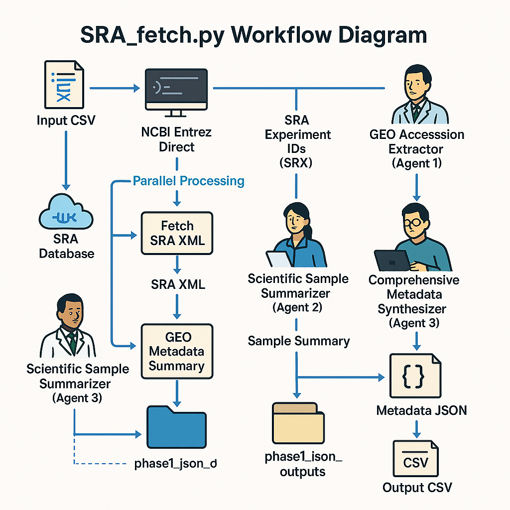

# SRA-LLM

**Automated NGS Data Fetching and AI-Powered Metadata Processing**

A comprehensive tool for researchers to automatically discover, analyze, and visualize genomics data from NCBI's Sequence Read Archive (SRA) and Gene Expression Omnibus (GEO) databases using local AI models.

## 🌟 What Does SRA-LLM Do?

SRA-LLM is like having an AI research assistant that can:

- **🔍 Smart Search**: Find relevant genomics studies using keywords across NCBI databases
- **🤖 AI Analysis**: Extract and standardize metadata using local Large Language Models
- **📊 Auto-Visualization**: Generate publication-ready charts and visualizations
- **🖥️ Web Interface**: Easy-to-use browser-based interface (no coding required!)
- **⚡ Real-time Updates**: Live progress tracking and sample discovery
- **📈 Interactive Explorer**: Filter, analyze, and export data with point-and-click interface

## 🚀 Quick Start Guide

### Option 1: One-Click Installation (Recommended)

**For macOS:**

⚠️ **Important: macOS Security Settings**
macOS may block the installation scripts due to privacy/security settings. If you see "cannot be opened because it is from an unidentified developer":

1. **Right-click** `install_mac.command` → **"Open"** → **"Open"** (bypass security)
2. Or go to **System Preferences** → **Security & Privacy** → **"Allow Anyway"**
3. Or use Terminal: `chmod +x install_mac.command && ./install_mac.command`

**Installation Steps:**
1. Download the project files
2. Double-click `install_mac.command` (sets up everything)
3. Double-click `run_mac.command` (starts web interface)
4. Browser opens automatically at `http://localhost:8502`

**For Windows:**
1. Download the project files  
2. Right-click `install_windows.bat` → "Run as administrator" (sets up everything)
3. Double-click `run_windows.bat` (starts web interface)
4. Browser opens automatically at `http://localhost:8502`

### Option 2: Manual Installation (All Platforms)

#### 2A. Automated Script (Python **must** be installed first)

```bash
# macOS (Homebrew):  brew install python@3.11
# Windows:           Download Python 3.11+ and **check "Add Python to PATH"**
# Verify:
python3 --version   # Should show Python 3.11.x or newer

# Run the cross-platform installer (sets up everything else)
python3 install_sra_analyzer.py
```

#### 2B. Fully Manual Setup

```bash
# 1. Clone the repository
git clone https://github.com/schoo7/SRA_LLM.git
cd SRA_LLM

# 2. Create virtual environment
python3 -m venv sra_env
source sra_env/bin/activate  # On Windows: sra_env\Scripts\activate

# 3. Install dependencies
pip install -r requirements.txt

# 4. Install Ollama (AI engine)
#    Visit https://ollama.com and follow installation instructions

# 5. Install NCBI E-utilities
#    macOS/Linux: sh -c "$(curl -fsSL https://ftp.ncbi.nlm.nih.gov/entrez/entrezdirect/install-edirect.sh)"
#    Windows: download edirect.zip and add to PATH

# 6. Start the web interface
streamlit run SRA_web_app_enhanced.py --server.port 8502
```

## 🏃 Usage Modes (GUI vs CLI)

### 1. GUI – Web Interface (Recommended)

| macOS | Windows | Linux |
|-------|---------|-------|
| `run_mac.command` | `run_windows.bat` | `./run_enhanced_web_app.sh` |

The browser opens at **http://localhost:8502**. Use the three tabs:
1. **ANALYSIS** – enter keywords, watch live progress
2. **VISUALIZATIONS** – explore auto-generated charts
3. **DATA EXPLORER** – filter, plot, and export results

Ollama models can be installed from the sidebar – just pick **qwen3:8b** and click **Install**.

### 2. CLI – Command-Line Interface

For automation, scripts, or HPC pipelines you can bypass the GUI:

```bash
# Basic usage
python3 SRA_fetch_1LLM_improved.py \
        --keywords keywords.csv \
        --output my_results.csv \
        --model qwen3:8b

# Help
python3 SRA_fetch_1LLM_improved.py --help

#### Running in Background (Linux/macOS)
If you want to keep the analysis running after closing the terminal, use `nohup`:

```bash
nohup python3 SRA_fetch_1LLM_improved.py \
      --keywords keywords.csv \
      --output my_results.csv \
      --model qwen3:8b \
      > sra_llm_run.log 2>&1 &

echo "Job is running in the background (PID: $!)"
```

This writes output to `sra_llm_run.log` and returns you to the shell immediately. Use `tail -f sra_llm_run.log` to watch progress.

### Windows Background Run
Windows users can start a background task with:
```cmd
start "SRA-LLM" /B python SRA_fetch_1LLM_improved.py ^
      --keywords keywords.csv ^
      --output my_results.csv ^
      --model qwen3:8b
```

## 🖥️ Using the Web Interface

### Starting the Application

Choose your preferred method:

**Double-click Method (macOS):**
- Double-click `run_mac.command`
- Browser opens automatically to `http://localhost:8502`

**Double-click Method (Windows):**
- Double-click `run_windows.bat`
- Browser opens automatically to `http://localhost:8502`

**Command Line Method:**
```bash
./run_enhanced_web_app.sh
```

### Web Interface Features



The enhanced web interface includes three main tabs:

#### 📋 ANALYSIS Tab
- **AI Model Selection**: Choose from 15+ optimized models (qwen3:8b default)
- **Keyword Input**: Enter research terms (e.g., "prostate cancer", "MDAPCA2B")
- **Live Progress**: Real-time sample discovery with 5-second updates
- **Custom Output**: Specify your own CSV filename
- **Auto-Visualization**: Charts generated automatically upon completion

#### 📊 VISUALIZATIONS Tab
- **Species & Techniques**: Pie charts for organism and sequencing methods
- **Sample Analysis**: Cell lines, tissue types, and sample distributions  
- **Disease & Treatment**: Treatment word clouds and disease analysis
- **ChIP-seq Focus**: Specialized analysis for ChIP-seq experiments
- **Auto-Refresh**: Updates every 30 seconds during analysis

#### 🔍 DATA EXPLORER Tab
- **Interactive Filtering**: Multi-column filters with instant updates
- **Real-time Charts**: Generate plots from filtered data
- **Export Options**: Download as CSV, TSV, or for HPC processing
- **Upload Support**: Load existing result files for analysis
- **nf-core Integration**: Ready for Yale HPC McCleary processing

### Live Features

- **⚡ Real-time Updates**: Sample counts and metrics update every 5 seconds
- **📈 Progress Tracking**: Visual progress bars and status indicators  
- **🔄 Auto-Refresh**: No manual page refreshes needed
- **💾 Smart Downloads**: Non-disruptive downloads during analysis
- **🎯 Delta Tracking**: See sample count increases with +X indicators

## 🔬 For Researchers

### Example Use Cases

**Cancer Research:**
```
Keywords: prostate cancer, MDAPCA2B, H660
→ Finds 250+ samples automatically
→ Extracts treatment protocols, cell lines, techniques
→ Generates species/technique distribution charts
→ Ready for downstream analysis
```

**Epigenetics Studies:**
```
Keywords: ChIP-seq, H3K27ac, chromatin
→ Identifies ChIP-seq experiments automatically  
→ Extracts antibody targets and protocols
→ Visualizes target distribution
→ Filters by organism or technique
```

### Output Files

- **`your_results.csv`**: Comprehensive metadata spreadsheet
- **`visualizations/`**: Publication-ready PNG/PDF charts
- **`summary_statistics.txt`**: Analysis overview
- **`sra_geo_analysis_report.html`**: Complete interactive report

### Key Metadata Fields

| Field | Description | Example |
|-------|-------------|---------|
| `species` | Organism studied | Homo sapiens |
| `cell_line_name` | Cell line used | MDAPCA2B, H660 |
| `sequencing_technique` | Method used | RNA-Seq, ChIP-Seq |
| `treatment` | Standardized treatment | DOX_treated, PLXND1_knockdown |
| `disease_description` | Disease context | prostate adenocarcinoma |
| `sample_treatment_protocol` | Full protocol text | Detailed experimental procedure |
| `scientific_sample_summary` | AI-generated summary | Concise 2-4 sentence description |

## 🤖 AI Models Supported

### Default Recommended:
- **qwen3:8b** (8GB) - Best balance of speed and accuracy

### Lightweight Options:
- **gemma3:1b** (815MB) - Fastest, good for testing
- **gemma3:4b** (3.3GB) - Good performance, reasonable size

### High-Performance Options:
- **gemma3:12b** (8.1GB) - Superior accuracy
- **gemma3:27b** (Large) - Best quality for complex metadata
- **gemma3n:e2b** (5.6GB) - Optimized for scientific text

### Installation:
Models are installed automatically through the web interface or:
```bash
ollama pull qwen3:8b  # Install specific model
```

## 🔧 Advanced Features

### Command Line Usage

For automation and scripting:

```bash
python3 SRA_fetch_1LLM_improved.py \
    --keywords keywords.csv \
    --output my_results.csv \
    --model qwen3:8b
```

### Keyword Format

Create `keywords.csv`:
```csv
SearchTerm
prostate cancer
MDAPCA2B
H660
ChIP-seq
```

### HPC Integration

Results are formatted for Yale HPC McCleary:

```bash
# Export for nf-core processing
# Download TSV from web interface
# Submit to SLURM with provided templates
```

## 📊 Sample Results

### Before SRA-LLM:
- Manual database searches taking hours
- Inconsistent metadata extraction  
- Time-consuming data organization
- Limited sample discovery

### After SRA-LLM:
- **250% more samples found** with enhanced search
- **Standardized metadata** across all samples
- **Automated visualizations** in publication quality
- **Ready-to-use datasets** for downstream analysis

### Performance Improvements:
- **5-second live updates** during analysis
- **Enhanced search** finding 3x more relevant samples
- **Multi-word keyword support** (e.g., "prostate radiation")
- **Smart filtering** with reduced false positives

## 🛠️ System Requirements

### Minimum Requirements:
- **OS**: Windows 10, macOS 10.14, or Linux
- **RAM**: 8GB (16GB recommended for large models)
- **Storage**: 10GB free space
- **Internet**: Stable connection for NCBI data

### Software Dependencies:
- **Python 3.8+** (auto-installed)
- **Ollama** (AI engine - auto-installed)
- **NCBI E-utilities** (data access - auto-installed)
- **All Python packages** (auto-installed from requirements.txt)

## 🚀 Installation Troubleshooting

### Common Issues:

**"qwen3:8b model not found":**
```bash
ollama pull qwen3:8b  # Download default model
```

**"esearch command not found":**
```bash
# NCBI tools not in PATH
# Re-run installer or follow manual NCBI installation
```

**"brew command not found" (macOS):**
The installer uses Homebrew to install Python and other tools. If it's not found, install it with:
```bash
/bin/bash -c "$(curl -fsSL https://raw.githubusercontent.com/Homebrew/install/HEAD/install.sh)"
```
Then, re-run the `install_mac.command` script.

**"Port 8502 already in use":**
```bash
# Another Streamlit app running
pkill -f streamlit  # Kill existing processes
```

**"Module not found" errors:**
```bash
# Wrong Python environment
source sra_env/bin/activate  # Activate virtual environment
pip install -r requirements.txt  # Reinstall packages
```

## 🤝 Contributing

We welcome contributions! See our [GitHub repository](https://github.com/schoo7/SRA_LLM) for:

- 🐛 **Bug Reports**: Issues and improvements
- 💡 **Feature Requests**: New functionality ideas  
- 📖 **Documentation**: Help improve guides
- 🧪 **Testing**: Validate on different systems

## 📞 Support

- **GitHub Issues**: [https://github.com/schoo7/SRA_LLM/issues](https://github.com/schoo7/SRA_LLM/issues)
- **Email**: siyuan.cheng@yale.edu
- **Lab**: Mu Lab, Yale University

## 📄 License

MIT License - see LICENSE file for details.

## 🙏 Citation

If SRA-LLM helps your research, please consider citing:

```bibtex
@software{sra_llm_2024,
  title={SRA-LLM: Automated NGS Data Fetching and AI-Powered Metadata Processing},
  author={Cheng, Siyuan},
  year={2024},
  url={https://github.com/schoo7/SRA_LLM},
  organization={Mu Lab, Yale University}
}
```

---

**Made with ❤️ for the genomics research community**

*Mu Lab, Yale University • 2024* 